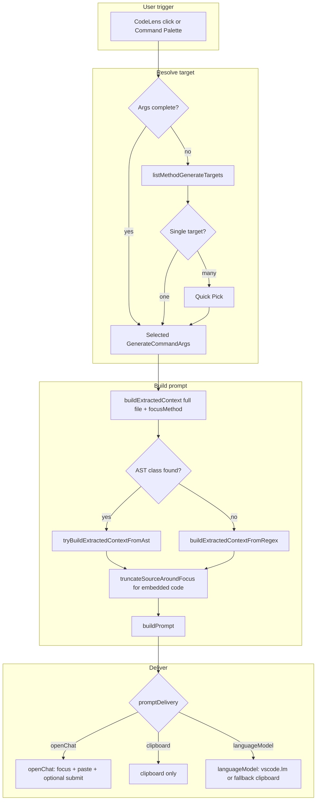
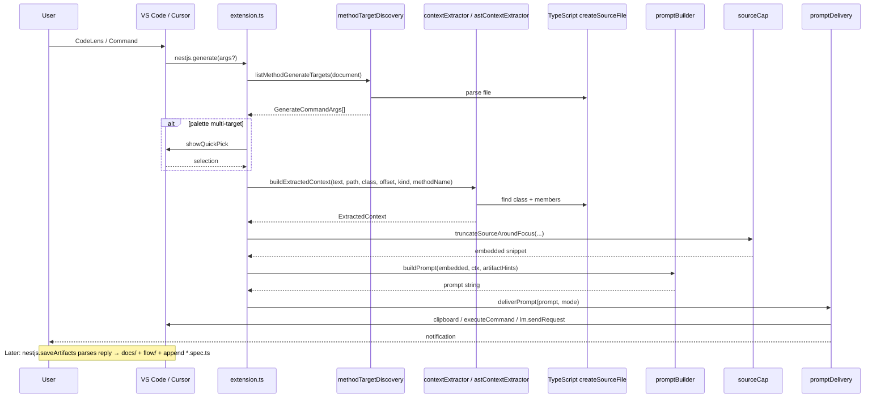
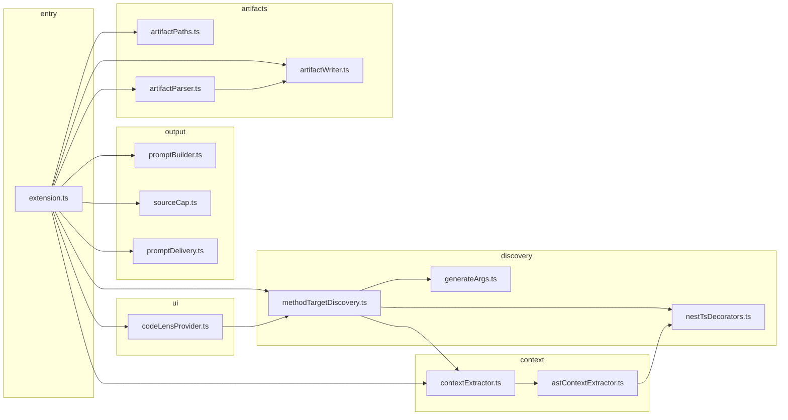
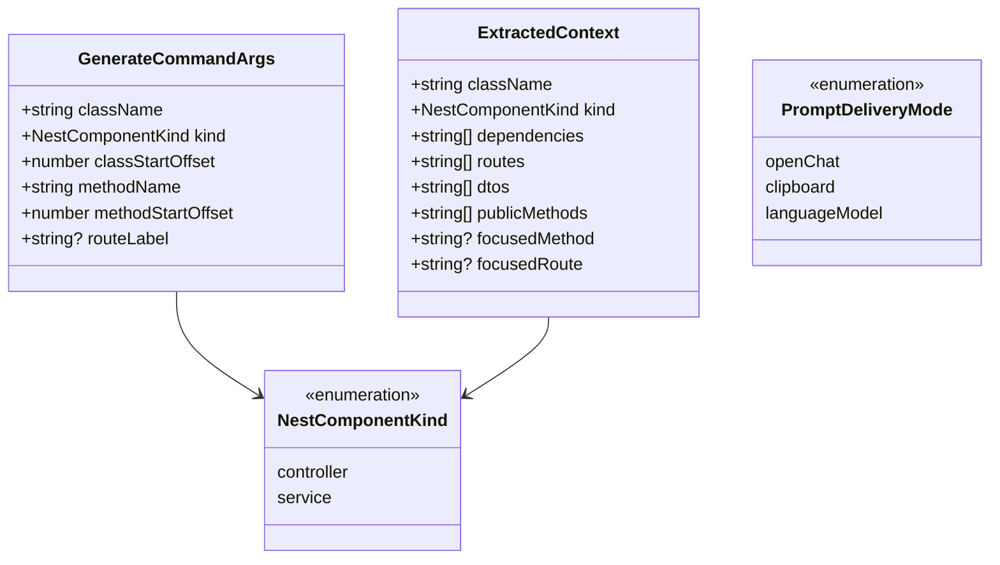

# NestJS Generator — Implementation Documentation

This document describes how the **NestJS Generator** VS Code / Cursor extension is built end-to-end: modules, data flow, configuration, packaging, and where to learn more. It is meant for contributors who want to extend the tool or reuse its patterns.

---

## Table of contents

1. [Goals and product contract](#1-goals-and-product-contract)
2. [High-level architecture](#2-high-level-architecture)
3. [UML diagrams (Mermaid)](#3-uml-diagrams-mermaid)
4. [Source modules (file-by-file)](#4-source-modules-file-by-file)
5. [Prompt pipeline (detailed)](#5-prompt-pipeline-detailed)
6. [Configuration reference](#6-configuration-reference)
7. [Build, package, and runtime dependencies](#7-build-package-and-runtime-dependencies)
8. [Limitations and design trade-offs](#8-limitations-and-design-trade-offs)
9. [Ideas for further work](#9-ideas-for-further-work)
10. [References and further reading](#10-references-and-further-reading)

---

## 1. Goals and product contract

| Goal | Implementation |
|------|----------------|
| One action per **HTTP handler** or **service method** | `methodTargetDiscovery.ts` + `NestCodeLensProvider` |
| Structured LLM output (`### TEST`, `### DOCS`, `### DIAGRAM`) | `promptBuilder.ts` embeds strict templates |
| Rich context (routes, deps, DTO hints) | `astContextExtractor.ts` (primary) + `contextExtractor.ts` (regex fallback) |
| Large files | `sourceCap.ts` + `maxSourceCharacters` (embedding only; full file used for extraction) |
| Palette without CodeLens | `extension.ts` → Quick Pick over all method targets |
| Deliver prompt into AI UI | `promptDelivery.ts` (best-effort commands + optional `vscode.lm`) |

The original PRD emphasized **non-goals** for MVP: no full-repo graph, no auto-save, no deep AST everywhere. This codebase uses **AST for extraction** where the TypeScript parse succeeds, and **regex** when it cannot resolve the class.

---

## 2. High-level architecture

```text
┌─────────────────────────────────────────────────────────────────┐
│                     VS Code / Cursor host                        │
│  ┌──────────────┐    ┌─────────────────┐    ┌────────────────┐  │
│  │ CodeLens UI  │───▶│ nestjs.generate │───▶│ promptDelivery │──┼──▶ Chat / clipboard / lm
│  └──────────────┘    └────────▲────────┘    └────────────────┘  │
│                               │                                  │
│  ┌────────────────────────────┴──────────────────────────────┐  │
│  │ extension.ts: resolve target → build context → build text │  │
│  └──────────┬───────────────────────────────┬────────────────┘  │
│             │                               │                    │
│  ┌──────────▼──────────┐         ┌─────────▼──────────┐         │
│  │ methodTargetDiscovery│         │ contextExtractor   │         │
│  │ + nestTsDecorators   │         │ + astContextExtr.  │         │
│  └─────────────────────┘         └─────────┬──────────┘         │
│                                              │                    │
│                                     ┌────────▼────────┐           │
│                                     │ typescript     │           │
│                                     │ (Compiler API)   │           │
│                                     └─────────────────┘           │
└─────────────────────────────────────────────────────────────────┘
```

**Activation:** `onLanguage:typescript` (see `package.json` → `activationEvents`). The extension **main** entry is compiled `out/extension.js` from `src/extension.ts`.

---

## 3. UML diagrams (Mermaid)

### 3.1 Activity flow (end-to-end)

This is the main **business flow** from user gesture to delivered prompt.



### 3.2 Sequence diagram (components)



### 3.3 Component / package diagram (modules)

Treated as a **UML component-style** view: nodes are TS modules and edges are imports.



### 3.4 Class-style view (core data)

Mermaid class diagram for the **main data contracts** (interfaces live across files).



---

## 4. Source modules (file-by-file)

| File | Responsibility |
|------|----------------|
| [`src/extension.ts`](../src/extension.ts) | `activate()`: registers CodeLens provider and `nestjs.generate`; resolves targets (CodeLens args vs Quick Pick); orchestrates context → prompt → `deliverPrompt`. |
| [`src/codeLensProvider.ts`](../src/codeLensProvider.ts) | Implements `vscode.CodeLensProvider`; one lens per method target; command title uses `routeLabel` (controllers) or `className.methodName` (services). |
| [`src/generateArgs.ts`](../src/generateArgs.ts) | `GenerateCommandArgs` interface passed from CodeLens / Quick Pick to the command handler. |
| [`src/methodTargetDiscovery.ts`](../src/methodTargetDiscovery.ts) | Walks TS AST: finds Nest **controllers** (`@Controller` + HTTP method) and **services** (`@Injectable` + `*Service` or `*.service.ts`); emits one arg per handler/method; lens position = first method decorator or method name. |
| [`src/nestTsDecorators.ts`](../src/nestTsDecorators.ts) | Shared pure helpers: `decoratorName`, `firstStringArg`, `controllerBasePath`, `joinNestRoute`, `HTTP_VERBS`, `routeLabelForMethod`. |
| [`src/contextExtractor.ts`](../src/contextExtractor.ts) | `detectNestComponent`, `ExtractedContext`, `buildExtractedContext`: tries AST first, else regex on class body; optional **method focus** narrows routes/DTOs/methods; exports regex helpers for fallback. |
| [`src/astContextExtractor.ts`](../src/astContextExtractor.ts) | `tryBuildExtractedContextFromAst`: uses `ts.createSourceFile`, finds class, extracts constructor deps, routes (full or per-method), param decorator hints, public methods; sets `focusedRoute` when scoped. |
| [`src/promptBuilder.ts`](../src/promptBuilder.ts) | Builds the final string prompt with **SCOPE** block when `focusedMethod` is set; controller vs service templates; enforces section headers for the LLM. |
| [`src/sourceCap.ts`](../src/sourceCap.ts) | `truncateSourceAroundFocus`: centers a character window on the handler for the `Code:` block only. |
| [`src/promptDelivery.ts`](../src/promptDelivery.ts) | `deliverPrompt`: `openChat` (clipboard + `executeCommand` chain), `clipboard`, or `languageModel` via `vscode.lm.selectChatModels` + `sendRequest` + new Markdown document. |
| [`src/artifactPaths.ts`](../src/artifactPaths.ts) | Sanitized filenames, `docs/` / `flow/` relative paths, spec path beside source. |
| [`src/artifactParser.ts`](../src/artifactParser.ts) | Parses `### TEST` / `### DOCS` / `### DIAGRAM` fenced blocks from pasted model output. |
| [`src/artifactWriter.ts`](../src/artifactWriter.ts) | Writes docs + flow Markdown; **appends** test snippet to existing `*.spec.ts` or creates file (checks disk at write time). |

---

## 5. Prompt pipeline (detailed)

### 5.1 Target discovery

1. Parse document with **`typescript.createSourceFile`** (same library bundled in the VSIX).
2. Visit every `ClassDeclaration`.
3. Locate `export class Name` / `export abstract class Name` offset in source for `detectNestComponent`.
4. **Controller:** for each method with any of `Get|Post|Put|Patch|Delete|Options|Head|All` decorators, emit a target with `routeLabelForMethod`.
5. **Service:** for each **public** method (not `private`, not `constructor`), emit a target.

### 5.2 Context extraction

1. **`buildExtractedContext(text, filePath, className, exportClassIndex, kind, focusMethod?)`**
2. AST path resolves the class node; if `focusMethod` is set:
   - Routes: only HTTP decorators on that method (joined with controller base path).
   - DTO hints: only parameters on that method with `@Body` / `@Query` / `@Param` / `@Headers`.
   - Public methods list: single method signature line.
3. Dependencies: always **constructor** injection list for the class (needed for Jest mocks).
4. If AST cannot find the class, regex fallback scans the class body string; route-for-method uses “last HTTP decorator before `methodName(`” heuristic.

### 5.3 Prompt text

- **Embedded code** may be truncated by settings; **extraction always uses full file text**.
- Prompt includes strict **OUTPUT FORMAT** and, when focused, **SCOPE (strict)** so the model does not spill into other endpoints.

### 5.4 Delivery

- **`openChat`:** not an official Cursor API; uses configurable **`vscode.commands.executeCommand`** IDs. Clipboard is populated before paste so failures still allow manual paste.
- **`languageModel`:** uses the standard **`vscode.lm`** API ([VS Code docs](#10-references-and-further-reading)); availability depends on the host (Copilot-style vs Cursor).

---

## 6. Configuration reference

All keys live under **`nestjs-generator.*`** in `package.json` → `contributes.configuration`.

| Key | Type | Default | Role |
|-----|------|---------|------|
| `maxSourceCharacters` | number | `0` | Max length of source **in the prompt**; `0` = unlimited. |
| `promptDelivery` | enum | `openChat` | `openChat` \| `clipboard` \| `languageModel`. |
| `chatFocusCommands` | string[] | `["aichat.newchataction"]` | Commands run before paste. |
| `chatPasteDelayMs` | number | `350` | Delay after focus commands. |
| `chatSubmitDelayMs` | number | `120` | Delay after paste before submit command. |
| `chatPasteCommand` | string | `editor.action.clipboardPasteAction` | Paste command. |
| `chatSubmitCommand` | string | `""` | Optional submit command ID. |

---

## 7. Build, package, and runtime dependencies

| Topic | Detail |
|-------|--------|
| Compile | `tsc` → `out/` (`tsconfig.json`, `rootDir`: `src`). |
| VSIX | `npm run package` uses `@vscode/vsce`; **`typescript`** is a **runtime** `dependency` (bundled under `node_modules/typescript` in the VSIX — see `.vscodeignore` allowlist). |
| Engine | `"vscode": "^1.85.0"` in `package.json`. |
| Secret scan workaround | `package` script passes flags for `vsce` when packaged files are only under `node_modules` for scanning quirks (documented in [`README.md`](../README.md)). |

---

## 8. Limitations and design trade-offs

1. **Cursor chat control:** No stable public API to inject and submit chat text; delivery is **heuristic** and may paste into the wrong focused editor if timing/focus is wrong.
2. **`vscode.lm` in Cursor:** Often **no registered models**; `languageModel` mode may fall back to clipboard.
3. **Regex fallback:** Weaker than AST for nested braces, multiple decorators, or unusual syntax.
4. **Service detection:** Heuristic (`*Service` / `*.service.ts` / `@Injectable`); guards/pipes named differently are skipped by design.
5. **UTF-16 offsets:** `String` indices match VS Code document offsets for BMP; rare astral Unicode edge cases can desync lens position slightly.
6. **VSIX size:** Bundling the full `typescript` package increases size (~4–5 MB) but keeps `createSourceFile` reliable offline.

---

## 9. Ideas for further work

Short, implementation-oriented extensions you can explore:

- **AST-only path:** Drop regex fallback or gate it behind a setting; add `ts.createProgram` with project references for cross-file DTO resolution (heavier).
- **Custom Editor / Webview:** Own panel that calls your backend LLM and writes `.spec.ts` / `.md` files (PRD Phase 3–4).
- **File writer:** Parse LLM output sections and `workspace.applyEdit` to create files (needs robust parsing and user confirmation).
- **Test runner:** `vscode.tasks.executeTask` to run `jest` on the generated spec.
- **Multi-root workspace:** Pick Nest project root from `nestjs-cli.json` or `package.json` scripts.
- **Stable Cursor integration:** If Cursor ever documents chat APIs, replace `promptDelivery` command guessing with official calls.
- **esbuild bundle:** Shrink VSIX by bundling only compiler entry points (advanced packaging).

---

## 10. References and further reading

### VS Code extension API

- [Extension API](https://code.visualstudio.com/api) — activation, commands, configuration, CodeLens.
- [CodeLens provider](https://code.visualstudio.com/api/references/vscode-api#CodeLensProvider) — `provideCodeLenses`.
- [Command `executeCommand`](https://code.visualstudio.com/api/references/vscode-api#commands) — used for chat heuristics.

### Language models in VS Code

- [`vscode.lm` namespace](https://code.visualstudio.com/api/references/vscode-api#lm) — `selectChatModels`, `LanguageModelChat.sendRequest`.
- [Language Model API guide](https://code.visualstudio.com/api/extension-guides/language-model) — concepts and consent.

### TypeScript compiler API

- [Using the Compiler API (wiki)](https://github.com/microsoft/TypeScript/wiki/Using-the-Compiler-API) — `createSourceFile`, walking the AST.
- Package: [`typescript` on npm](https://www.npmjs.com/package/typescript) (bundled as runtime dependency in this extension).

### Packaging

- [`@vscode/vsce`](https://github.com/microsoft/vscode-vsce) — `vsce package`, publishing.
- [Publishing extensions](https://code.visualstudio.com/api/working-with-extensions/publishing-extension).

### Cursor-specific (informal)

- Cursor forum: [API or command to send text programmatically](https://forum.cursor.com/t/api-or-command-to-send-text-programmatically/19345) — context for why chat automation is fragile.
- Community notes on command IDs such as `aichat.newchataction` (may change between Cursor versions).

### Internal repo files

- [`README.md`](../README.md) — user-facing install and usage.
- [`package.json`](../package.json) — `contributes`, scripts, dependencies.
- [`tsconfig.json`](../tsconfig.json) — compiler options.

---

*Document version: matches extension **0.6.0** (`package.json`). Update this file when architecture or settings change materially.*
